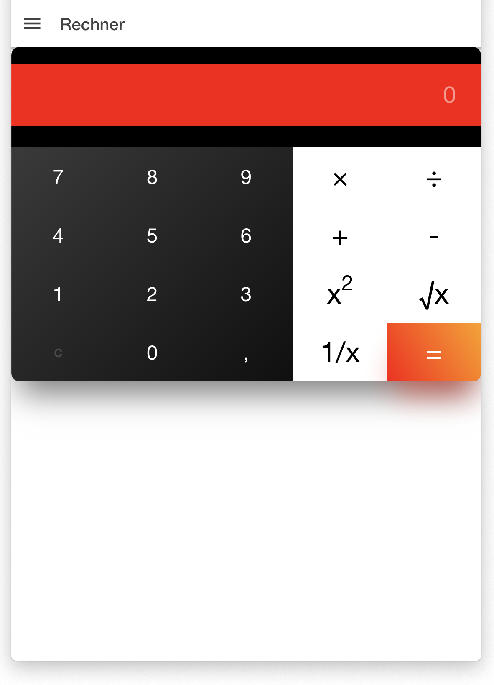

# Calculators with Ionic 4

Simple Ionic project to demonstrate how to build a calculator app.

This means:
- working with css and grid to setup a nice display of a calculate
- working with typescript to handle the evaluation 

